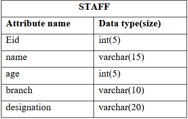
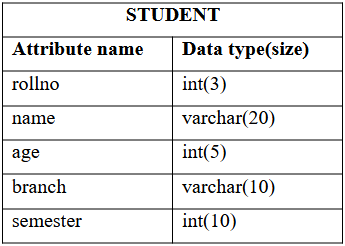

# DBMS LAB S4

This repository contains solutions of all DBMS Lab Problem(S4 KTU Model Engineering College)

## 1.Familiarization of DDL Commands

a) Create a database for the college

b) Create 2 tables student and staff tables with following fields respectively.

c) List out the tables present in the college database.

d) Show the structure of student table, staff table.

e) Insert values into student table and staff table (at least 3 rows)

f) Alter the student table 
    • by adding a column called 'contact number'(int fileld) and insert values into the added filed.
    • by droping a coloumn named 'contact number'
    • modify the existing column named 'semester' 
			# by modidying its data type from 'int' to 'varchar'
			# by modifying the width of the column from 10 to 5
			# modifying the constraint of 'semester' colomn from NULL to NOT NULL

g) Retrieve all data present in student table.

h) Rename student table as 'student details' and  staff table as 'staff details'

i) Delete all data present in the student table and staff table

j) Drop student table as well as staff table

k) Drop college database

<a href="https://github.com/Abhijith-2002/DBMS-Lab/blob/main/DDL_Commands.sql">Solution</a>