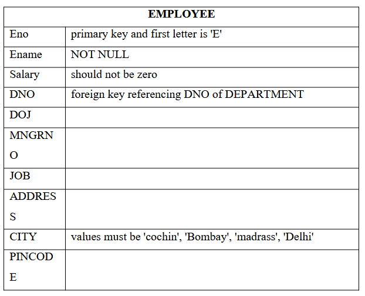
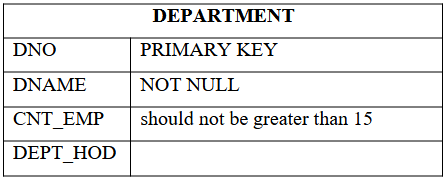
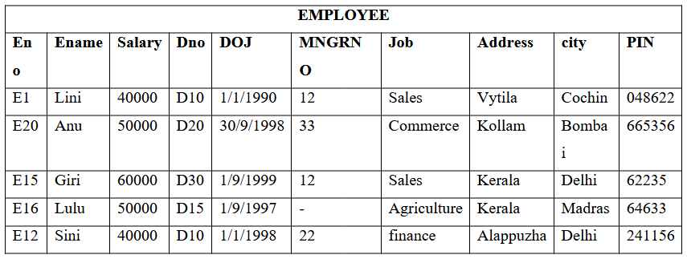
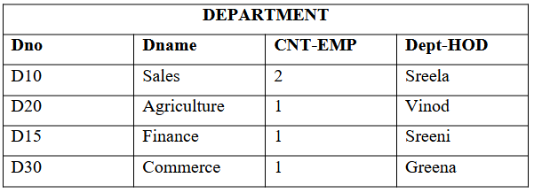

# DBMS LAB S4

This repository contains solutions of all DBMS Lab Problem(S4 KTU Model Engineering College)

## 1.Familiarization of DDL Commands

a) Create a database for the college

b) Create 2 tables student and staff tables with following fields respectively.

c) List out the tables present in the college database.

d) Show the structure of student table, staff table.

e) Insert values into student table and staff table (at least 3 rows)

f) Alter the student table 
    • by adding a column called 'contact number'(int fileld) and insert values into the added filed.
    • by droping a coloumn named 'contact number'
    • modify the existing column named 'semester' 
			# by modidying its data type from 'int' to 'varchar'
			# by modifying the width of the column from 10 to 5
			# modifying the constraint of 'semester' colomn from NULL to NOT NULL

g) Retrieve all data present in student table.

h) Rename student table as 'student details' and  staff table as 'staff details'

i) Delete all data present in the student table and staff table

j) Drop student table as well as staff table

k) Drop college database

<a href="https://github.com/Abhijith-2002/DBMS-Lab/blob/main/DDL_Commands.sql">Solution</a>

## 2.Familiarization of DML Commands

Create 2 tables employee and department with the corresponding field and constraints given below

a) Insert values into employee and department tables

b) Display all the employee details & department details

c) update the 'city' and 'salary' of emplyee whose Eid=E12 to 'cochin' and '70000'

d) Display all the employee details & department details

e) List the name of employees joined after 1-1-1998 and working in department number d10

f) List all employees working in department other than department number d30

g) List the name of employees working in department 'sales'

h) List the name of employee who does not have a manager

i) Display employees details whose city=’cochin’

j) List the HOD’s of different department

k) Find out who is the HOD of department D20

l) Delete employee whose Eid=E15 from employee table

m) Display details of employee table

n) Delete employees whose city=’Delhi’

o) Display details of employee table

p) Delete all the employees from employee table

q) Display details of employee table

<a href="https://github.com/Abhijith-2002/DBMS-Lab/blob/main/DML_Commands.sql">Solution</a>