# DBMS LAB S4

This repository contains solutions of all DBMS Lab Problem(S4 KTU Model Engineering College)

## 1.Familiarization of DDL Commands

a) Create a database for the college

b) Create 2 tables student and staff tables with following fields respectively.

c) List out the tables present in the college database.

d) Show the structure of student table, staff table.

e) Insert values into student table and staff table (at least 3 rows)

f) Alter the student table 
    • by adding a column called 'contact number'(int fileld) and insert values into the added filed.
    • by droping a coloumn named 'contact number'
    • modify the existing column named 'semester' 
			# by modidying its data type from 'int' to 'varchar'
			# by modifying the width of the column from 10 to 5
			# modifying the constraint of 'semester' colomn from NULL to NOT NULL

g) Retrieve all data present in student table.

h) Rename student table as 'student details' and  staff table as 'staff details'

i) Delete all data present in the student table and staff table

j) Drop student table as well as staff table

k) Drop college database

<a href="https://github.com/Abhijith-2002/DBMS-Lab/blob/main/DDL_Commands.sql">Solution</a>

## 2.Familiarization of DML Commands

Create 2 tables employee and department with the corresponding field and constraints given below

a) Insert values into employee and department tables

b) Display all the employee details & department details

c) update the 'city' and 'salary' of emplyee whose Eid=E12 to 'cochin' and '70000'

d) Display all the employee details & department details

e) List the name of employees joined after 1-1-1998 and working in department number d10

f) List all employees working in department other than department number d30

g) List the name of employees working in department 'sales'

h) List the name of employee who does not have a manager

i) Display employees details whose city=’cochin’

j) List the HOD’s of different department

k) Find out who is the HOD of department D20

l) Delete employee whose Eid=E15 from employee table

m) Display details of employee table

n) Delete employees whose city=’Delhi’

o) Display details of employee table

p) Delete all the employees from employee table

q) Display details of employee table

<a href="https://github.com/Abhijith-2002/DBMS-Lab/blob/main/DML_Commands.sql">Solution</a>

## 3.Familiarization of TCL Commands

Create a database for bank & create a table with name ‘savings-account’. The fields are CID, cname, balance, date of joining.

a) Add 2 records to the ‘savings-account’ table

b) Display the values of ‘savings-account’ table

c) Make the changes permanently

d) Add 2 more records to the ‘savings-account’ table

e) Display all the records of ‘savings-account’ table

f) Modify the balance amount by adding the interest of 6%

g) Display all the records of ‘savings-account’ table

h) Abandon the last changes

i) Display all the records of ‘savings-account’ table

j) Add a marker to the changed state as ‘A’

k) Add two more records to the ‘’savings-account’ table

l) Display all the records of ‘savings-account’ table

m) Modify the balance amount by adding the interest of 6%

n) Display all the records of ‘savings-account’ table

o) Add a marker to the changed state as ‘B’

p) Delete one record from the ‘savings-account table

q) Display all the records of ‘savings-account’ table

r) Abandon the last deletion (ie, recover the table with deleted row)

s) Display all the records of ‘savings-account’ table

t) Abandon to save point/marker ‘A’

u) Display all the records of ‘savings-account’ table

<a href="https://github.com/Abhijith-2002/DBMS-Lab/blob/main/TCL_Commands.sql">Solution</a>

## 4. GROUP BY, ORDER BY & HAVING CLAUSE

Create a table called ‘members’ to store member’s details of a family in the ‘family’ database. The attributes of the table are (mno, mname, mage, role, gender).This family consists of twins

a) Insert following values into ‘members’ table.

b) Returns all the gender entries from the ‘members’ table

c) Retrieve unique values for genders

d) Returns all member’s name, age, role from ‘members’ table

e) Select any one child who is eligible for voting

f) Find out the total no. of males and females in the given family

g) Select all the eligible candidate’s details for voting in the given family

h) Arrange members of the family in increasing order of age

i) Arrange members of the family in decreasing order of age

j) Identify twins in the family and display their details

<a href="https://github.com/Abhijith-2002/DBMS-Lab/blob/main/Group_By_Having_Order_By.sql">Solution</a>

## 5. Familiarization of DCL Commands

a) creates two new users with name ‘student’ and ‘teacher’

b) grant a CREATE TABLE and INSERT privileges to the teacher user and create a table named ‘advisors’ with following data

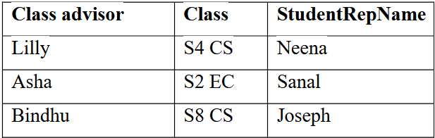

c) Grant SELECT Privilege to teacher user in ‘advisors’ table

d) Grant more than one Privilege (such as ALTER, DELETE) to teacher user and delete record corresponding to S8 CS students since they left college. add 1 more column called ‘studentscount’ in ‘advisors’ table

e) Grant the GRANT Privilege to teacher user in ‘advisors’ table

f) Allows a teacher user to grant SELECT access rights to student user in ‘advisors’ table

g) Grant a UPDATE privilege to all users in ‘advisors’ table and update the S4 CS & S2 EC’s students count as 40 and 45 respectively (using PUBLIC option)

h) Grant a DROP privilege to all users in ‘advisors’ table (using '*'@'localhost' option)

i) Grant all the Privilege to teacher user in ‘advisors’ table

j) Check the Privileges Granted to different users

k) Revoke SELECT Privilege from teacher user in ‘advisors’ table

l)Revoke more than Privilege (UPDATE, DROP, ALTER, DELETE) from teacher user in ‘advisors’ table

m)Revoke a SELECT privilege from all users in ‘advisors’ table

n) Revoke All the Privilege from student user in ‘advisors’ table

o) Revoke All the Privilege from teacher user in ‘advisors’ table

p) Check the Privileges Granted to different users

q) create a role called "developer"

r) grant the role to users named student and teacher

s) grant CREATE TABLE, insert, select, delete, alter, drop privileges to the ROLE developer

t) Check the Privileges Granted to a developer role

u) Revoke an INSERT privilege granted to developer role

v) Revoke all the privileges granted to developer role

<a href="https://github.com/Abhijith-2002/DBMS-Lab/blob/main/DCL_Commands.sql">Solution</a>

## 6. Aggregate functions

Consider a student table with following data.

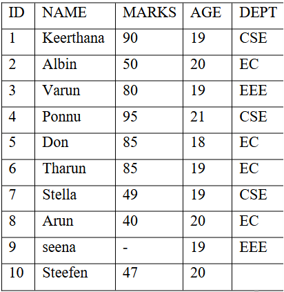

a)  Compute average marks & age of students

b) Compute total number of students

c) Compute number of students with unique/distinct age
 
d) Compute maximum marks (as Maxmarks) & age (as Maxage) among students from the Student table

e) Compute minimum marks (as Minimum marks) & age (as Minimum age) among students from the student table
 
f) Compute summation of total marks (Total Marks) among students from the Student table

g) Count number of non NULL marks fields in student table

h) Find the maximum marks of students whose age=19

i) Count the number of distinct age values in the table

j) Compute highest marks in each department

k) List out different departments in which students are studying

l) display name of the students who secured top marks in each department

m) display number of week students(marks<50) in each department

n) Find out name of the department and the number of students who secured more than 80 marks for department ranking, only departments with more than 2 students are eligible for ranking

o) For each department, retrieve the department name, and average marks of students in that department

p) lists the number of students in each department. Only include department with more than 1 students

q) Find out the students in same name

r) find number of students in same age

<a href="https://github.com/Abhijith-2002/DBMS-Lab/blob/main/Aggregate_Function.sql">Solution</a>

## 7. Set operators, Nested queries and JOIN queries.

### a) Nested Queries

Create 3 tables student (SID,sname,sage), course (CID,Cname) and student-course (SID,CID)

a) Display details of all the 3 tables

b) Find out student ID (SID) who are enrolled in course name ‘DSA’ or ‘DBMS’

c) Find out names of students who are either enrolled in ‘DSA’ or ‘DBMS’

d) Find out the names of students who are neither enrolled in ‘DSA’ nor in ‘DBMS’

e) Find out the names of students who are enrolled in course ID ‘C1’

<a href="https://github.com/Abhijith-2002/DBMS-Lab/blob/main/Nested_Queries.sql">Solution</a>

### b) SET operations

Based on the following given tables, write query for the following operations

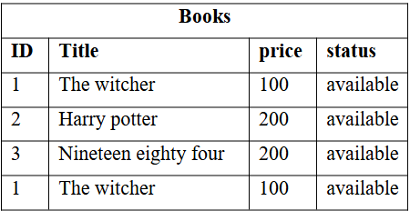

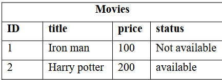
 
a) Returns all distinct rows from 2 tables. (UNION)

b) Returns all rows from 2 tables. (UNION ALL)

c) Returns all distinct rows common to both tables (INTERSECT)

d) Returns all rows common to both tables (INTERSECT ALL)

e) Returns all distinct rows from ‘books’ table that is not in ‘movies’ table.(EXCEPT)

f) Returns all rows from ‘books’ table that is not in ‘movies’ table. (EXCEPT ALL)

<a href="https://github.com/Abhijith-2002/DBMS-Lab/blob/main/Set_Operations.sql">Solution</a>

### c) JOIN operations

a) Create student table with following fields 

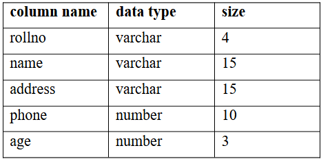

b) Insert the following values into student table

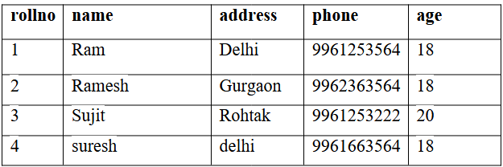

c) Create studentcourse table with following fields

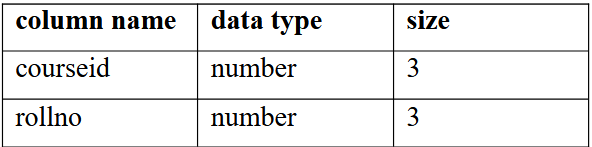

d) Insert the following values into studentcourse table

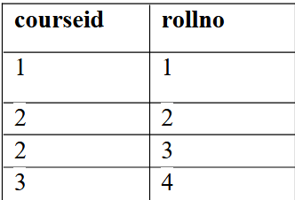

a) Display all the values of employee table

b) Display all the values of customer table

c) select NAME and Age from Student table and COURSEID from StudentCourse table. (cross join)

d) each row of the student table is joined with itself and all other rows depending on some conditions (eg: a.ROLL_NO < b.ROLL_NO). (self join)

o/p for given eg:

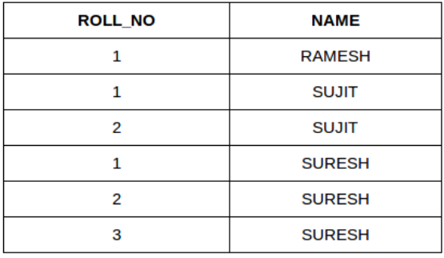

e)  Show the names and age of students enrolled in different courses. (equi join)

f) Perform natural join on ‘student’ and ‘studentcourse’ table

g) Perform left join on ‘student’ and ‘studentcourse’ table

h) Perform right join on ‘student’ and ‘studentcourse’ table

i) Perform full outer join on ‘student’ and ‘studentcourse’ table

<a href="https://github.com/Abhijith-2002/DBMS-Lab/blob/main/Join_Operations.sql">Solution</a>

## 10. VIEW and ASSERTION

a) Create a staff table with arguments staffed, sname, salary, sdept, scategory. Scategory can take 2 values (teaching/ non teaching) only

b) Insert the following values into staff table

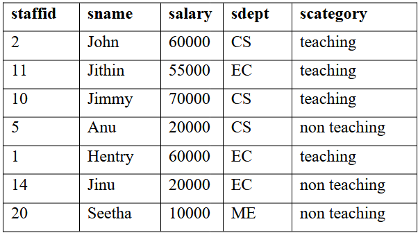

c) Display the details of staff table

a) Create a view named ‘faculty’ for teaching staff and ‘non-faculty’ for non teaching staff

b) Display the contents of ‘faculty’ & ‘non-faculty’ views

c) Update the salary of non-teaching staff whose staffed=20 to 15000 in corresponding view

d) Display the contents of ‘non-faculty’ view

e) Display the contents of staff table

f) Delete the details of staff whose staffed=11 from ‘faculty’ view

g) Display the contents of ‘faculty’ view

h) Create another table called ‘departmenthead’ with following details

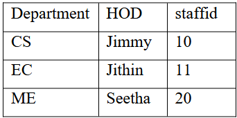

i) Create an assertion that specify the constraint that the salary of a staff must not be greater than salary of the HOD in which the staff works for

j) Create an assertion that ensure number of non-teaching staff less than number of teaching staff in a department

<a href="https://github.com/Abhijith-2002/DBMS-Lab/blob/main/View_And_Assertion.sql">Solution</a>