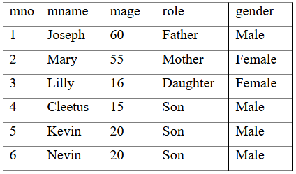

# DBMS LAB S4

This repository contains solutions of all DBMS Lab Problem(S4 KTU Model Engineering College)

## 1.Familiarization of DDL Commands

a) Create a database for the college

b) Create 2 tables student and staff tables with following fields respectively.

c) List out the tables present in the college database.

d) Show the structure of student table, staff table.

e) Insert values into student table and staff table (at least 3 rows)

f) Alter the student table 
    • by adding a column called 'contact number'(int fileld) and insert values into the added filed.
    • by droping a coloumn named 'contact number'
    • modify the existing column named 'semester' 
			# by modidying its data type from 'int' to 'varchar'
			# by modifying the width of the column from 10 to 5
			# modifying the constraint of 'semester' colomn from NULL to NOT NULL

g) Retrieve all data present in student table.

h) Rename student table as 'student details' and  staff table as 'staff details'

i) Delete all data present in the student table and staff table

j) Drop student table as well as staff table

k) Drop college database

<a href="https://github.com/Abhijith-2002/DBMS-Lab/blob/main/DDL_Commands.sql">Solution</a>

## 2.Familiarization of DML Commands

Create 2 tables employee and department with the corresponding field and constraints given below

a) Insert values into employee and department tables

b) Display all the employee details & department details

c) update the 'city' and 'salary' of emplyee whose Eid=E12 to 'cochin' and '70000'

d) Display all the employee details & department details

e) List the name of employees joined after 1-1-1998 and working in department number d10

f) List all employees working in department other than department number d30

g) List the name of employees working in department 'sales'

h) List the name of employee who does not have a manager

i) Display employees details whose city=’cochin’

j) List the HOD’s of different department

k) Find out who is the HOD of department D20

l) Delete employee whose Eid=E15 from employee table

m) Display details of employee table

n) Delete employees whose city=’Delhi’

o) Display details of employee table

p) Delete all the employees from employee table

q) Display details of employee table

<a href="https://github.com/Abhijith-2002/DBMS-Lab/blob/main/DML_Commands.sql">Solution</a>

## 3.Familiarization of TCL Commands

Create a database for bank & create a table with name ‘savings-account’. The fields are CID, cname, balance, date of joining.

a) Add 2 records to the ‘savings-account’ table

b) Display the values of ‘savings-account’ table

c) Make the changes permanently

d) Add 2 more records to the ‘savings-account’ table

e) Display all the records of ‘savings-account’ table

f) Modify the balance amount by adding the interest of 6%

g) Display all the records of ‘savings-account’ table

h) Abandon the last changes

i) Display all the records of ‘savings-account’ table

j) Add a marker to the changed state as ‘A’

k) Add two more records to the ‘’savings-account’ table

l) Display all the records of ‘savings-account’ table

m) Modify the balance amount by adding the interest of 6%

n) Display all the records of ‘savings-account’ table

o) Add a marker to the changed state as ‘B’

p) Delete one record from the ‘savings-account table

q) Display all the records of ‘savings-account’ table

r) Abandon the last deletion (ie, recover the table with deleted row)

s) Display all the records of ‘savings-account’ table

t) Abandon to save point/marker ‘A’

u) Display all the records of ‘savings-account’ table

<a href="https://github.com/Abhijith-2002/DBMS-Lab/blob/main/TCL_Commands.sql">Solution</a>

## 6. GROUP BY, ORDER BY & HAVING CLAUSE

Create a table called ‘members’ to store member’s details of a family in the ‘family’ database. The attributes of the table are (mno, mname, mage, role, gender).This family consists of twins

a) Insert following values into ‘members’ table.

b) Returns all the gender entries from the ‘members’ table

c) Retrieve unique values for genders

d) Returns all member’s name, age, role from ‘members’ table

e) Select any one child who is eligible for voting

f) Find out the total no. of males and females in the given family

g) Select all the eligible candidate’s details for voting in the given family

h) Arrange members of the family in increasing order of age

i) Arrange members of the family in decreasing order of age

j) Identify twins in the family and display their details

<a href="https://github.com/Abhijith-2002/DBMS-Lab/blob/main/Group_By_Having_Order_By.sql">Solution</a>
